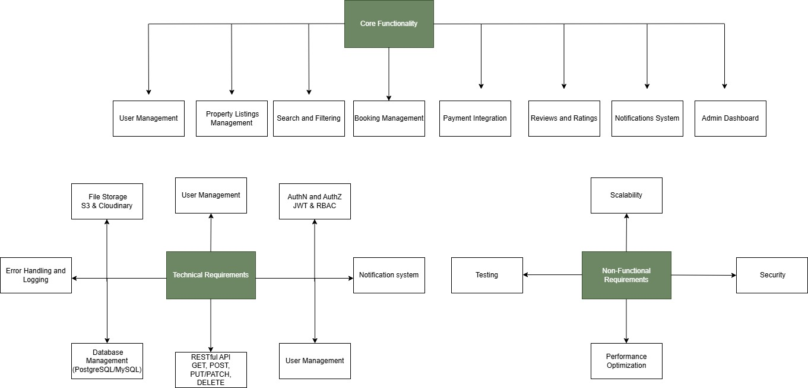

# Airbnb Clone Backend Project Requirements

## 🎯 Objective
Identify and document the key features and functionalities required to build a scalable, secure, and robust backend for the Airbnb Clone project.

---

## 📚 Introduction

The backend of the Airbnb Clone is responsible for server-side logic, database management, and API integrations. This document outlines the requirements necessary to deliver a functional, user-friendly, and efficient rental marketplace backend.

---

## 🔑 Core Functionalities

### 1. User Management

- **User Registration**
  - Allow users to sign up as guests or hosts.
  - Secure authentication (e.g., JWT).
- **User Login and Authentication**
  - Login via email and password.
  - OAuth support (Google, Facebook).
- **Profile Management**
  - Update profile details, photos, contact info, and preferences.

### 2. Property Listings Management

- **Add Listings**
  - Hosts can create property listings (title, description, location, price, amenities, availability).
- **Edit/Delete Listings**
  - Hosts can update or remove their listings.

### 3. Search and Filtering

- Search properties by:
  - Location
  - Price range
  - Number of guests
  - Amenities (Wi-Fi, pool, pet-friendly, etc.)
- Pagination for large result sets.

### 4. Booking Management

- **Booking Creation**
  - Guests can book properties for specific dates.
  - Prevent double bookings (date validation).
- **Booking Cancellation**
  - Guests/hosts can cancel bookings per policy.
- **Booking Status**
  - Track statuses: pending, confirmed, canceled, completed.

### 5. Payment Integration

- Secure payment gateways (Stripe, PayPal).
- Upfront payments by guests.
- Automatic payouts to hosts after completion.
- Support for multiple currencies.

### 6. Reviews and Ratings

- Guests can leave reviews and ratings.
- Hosts can respond to reviews.
- Reviews linked to specific bookings.

### 7. Notifications System

- Email and in-app notifications for:
  - Booking confirmations
  - Cancellations
  - Payment updates

### 8. Admin Dashboard

- Admin interface for managing:
  - Users
  - Listings
  - Bookings
  - Payments

---

## 🛠️ Technical Requirements

### 1. Database Management

- Use a relational database (PostgreSQL/MySQL).
- Required tables:
  - Users (guests, hosts)
  - Properties
  - Bookings
  - Reviews
  - Payments

### 2. API Development

- RESTful APIs for backend functionalities.
- Proper HTTP methods and status codes:
  - GET, POST, PUT/PATCH, DELETE
- (Optional) GraphQL for complex data fetching.

### 3. Authentication and Authorization

- JWT for secure sessions.
- Role-based access control (RBAC):
  - Guests
  - Hosts
  - Admins

### 4. File Storage

- Store property images and profile photos in cloud storage (e.g., AWS S3, Cloudinary).
- For implementation, use local file storage.

### 5. Third-Party Services

- Email notifications via SendGrid or Mailgun.

### 6. Error Handling and Logging

- Global error handling for APIs.
- Logging for monitoring and debugging.

---

## 🚀 Non-Functional Requirements

### 1. Scalability

- Modular architecture for easy scaling.
- Horizontal scaling with load balancers.

### 2. Security

- Encrypt sensitive data (passwords, payments).
- Firewalls and rate limiting.

### 3. Performance Optimization

- Caching (e.g., Redis) for frequently accessed data.
- Optimized database queries.

### 4. Testing

- Unit and integration tests (e.g., pytest).
- Automated API testing.

---

## 📁 Features Diagram

  

 

*This document serves as a comprehensive guide for the backend development of the Airbnb Clone project.